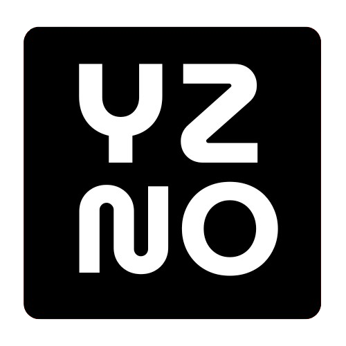
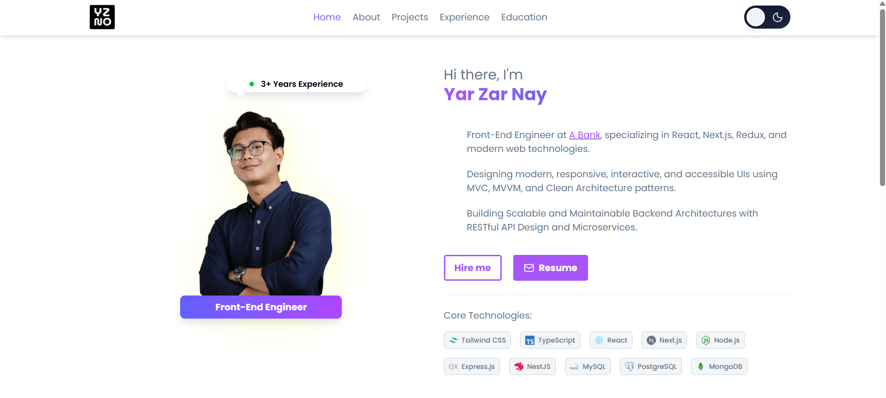
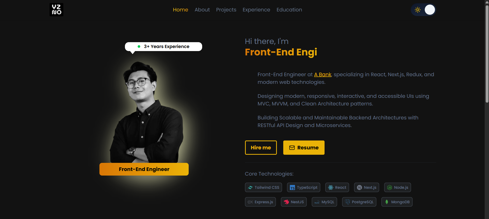

# ✨ YZNO Portfolio

<p align="center">
  
</p>

<p align="center">
  <a href="#introduction">Introduction</a> •
  <a href="#tech-stack">Tech Stack</a> •
  <a href="#features">Features</a> •
  <a href="#quick-start">Quick Start</a> •
  <a href="#screenshots">Screenshots</a>
</p>

---

## 📌 Introduction

This project is a personal portfolio website built with **Next.js**, **React**, **TypeScript**, **Tailwind CSS**, and **shadcn/ui**, focusing on **responsive design**, modern UI, and clean code.

---

## ⚙️ Tech Stack

- **Frontend:** TypeScript / React / Next.js
- **Styling:** Tailwind CSS / Shadcn

---

## 🔋 Features

- **Modern UI/UX** – Clean, responsive design with Tailwind CSS
- **Reusable Components** – Scalable component-based architecture
- **Mobile Responsive** – Works seamlessly across devices
- **Theme Support** – Includes light and dark themes with a smooth toggle.

---

## ✨ Quick Start

### Prerequisites

Make sure you have the following installed:

- Node.js
- npm
- Git

### Clone the Repository

```bash
git clone https://github.com/yarzarnayoo27/yzno-portfolio-frontend.git
cd project-name
```

### Install Dependencies

```bash
npm install
```

### Run the Project

```bash
npm run dev
```

Open **[http://localhost:3000](http://localhost:3000)** in your browser.

---

## 🖼️ Screenshots

<p align="center">
  
</p>

<p align="center">
  
</p>

---

## 📬 Contact

**Yar Zar Nay Oo**

- Mail: [yarzarnayoo27@gmail.com](mailto:yarzarnayoo27@gmail.com)
- GitHub: [https://github.com/yarzarnayoo27](https://github.com/yarzarnayoo27)
- LinkedIn: [https://www.linkedin.com/in/yarzarnayoo/](https://www.linkedin.com/in/yarzarnayoo/)

---

## 🚀 Deployment

- URL: [https://z292242-kp349w.ps09.zwhhosting.com/](https://z292242-kp349w.ps09.zwhhosting.com/)
- URL: [http://yarzarnayoo.com.z292242-kp349w.ps09.zwhhosting.com/](http://yarzarnayoo.com.z292242-kp349w.ps09.zwhhosting.com/)
- URL: [https://yarzarnayoo.vercel.app/](https://yarzarnayoo.vercel.app/)

---